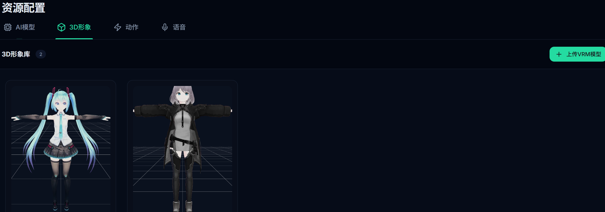

# Virtual Companion

<div align="center">

**轻量、私有、可定制的 3D AI 桌面陪伴伙伴**

[](LICENSE)
[](https://www.python.org/)
[](https://react.dev/)
[](https://tauri.app/)

[项目介绍](#项目介绍) · [核心功能](#核心功能) · [界面预览](#界面预览) · [安装使用](#安装使用) · [本地开发](#本地开发) · [参与贡献](#参与贡献)

</div>

## 项目介绍

Virtual Companion 是一款开源的 3D AI 桌面伴侣应用，集成大语言模型、离线语音识别、语音合成、长期记忆与 VRM 3D 渲染能力。

项目采用本地优先的设计思路，在兼顾隐私与可控性的同时，为角色设定、模型供应商、声音、背景和 3D 形象提供灵活的自定义能力。

## 核心功能

- **多模型支持**：可接入主流云端大语言模型与本地 Ollama 服务。
- **角色自定义**：支持配置角色设定、立绘、语音和模型参数。
- **离线语音识别**：集成 SenseVoice-Small ONNX，实现低延迟本地语音识别。
- **实时语音交流**：虚拟伙伴可以实时生成并播放语音，带来更加自然、连贯的对话体验。
- **多供应商语音合成**：支持多种 TTS 服务，并可为不同角色绑定专属声音。
- **长期记忆**：通过 LangGraph 管理结构化的短期与长期记忆。
- **3D 角色互动**：基于 React Three Fiber 与 VRM 实现实时渲染和动作驱动。
- **高品质自定义背景**：支持添加自定义背景图片，为虚拟伙伴创建更加精美、个性化的互动场景。
- **桌面端体验**：使用 Tauri 构建轻量、快速的原生桌面应用。

## 技术栈

- **前端**：React 19、Tailwind CSS、Framer Motion
- **3D 渲染**：React Three Fiber、VRM
- **后端**：FastAPI、Python 3.12、LangChain、LangGraph、aiosqlite
- **桌面容器**：Tauri
- **语音识别**：SenseVoice-Small ONNX
- **语音合成**：多供应商 TTS 接口，包括 GPT-SoVITS 等

## 界面预览

<div align="center">
  
  
</div>

## 安装使用

1. 前往 [Releases](https://github.com/xiaoming123-xm/Virtual-Companion/releases) 下载最新版本。
2. 完成安装或解压后，启动应用程序。
3. 打开「设置」，配置大语言模型 API Key 或本地 Ollama 服务地址。
4. 根据需要配置角色、语音、背景图片和 3D 模型。
5. 完成配置后，即可与虚拟伙伴进行文字或实时语音交流。

> 当前版本主要面向 Windows 10 / 11。

## 本地开发

### 环境要求

- Windows 10 / 11
- Python 3.12+
- Node.js 18+
- Rust 1.77+
- 推荐使用 [uv](https://github.com/astral-sh/uv) 管理 Python 环境

### 获取源代码

```bash
git clone https://github.com/xiaoming123-xm/Virtual-Companion.git
cd Virtual-Companion
检查开发环境
uv run python scripts/release.py check
启动桌面应用
cd frontend
npm install
npm run tauri:dev
更完整的开发说明请查看：
[开发指南](docs/01-入门/开发指南.md)
[桌面构建与发布指南](docs/01-入门/桌面构建与发布指南.md)
[文档中心](docs/README.md)
参与贡献
欢迎提交 Issue、功能建议和 Pull Request。
Fork 本仓库。

创建功能分支：
git checkout -b feat/your-feature

提交修改：
git commit -m "feat: add your feature"

推送功能分支：
git push origin feat/your-feature

在 GitHub 上创建 Pull Request。

Star History

许可证
本项目基于 MIT License 开源。使用、修改和分发本项目时，请遵守许可证中的相关条款。
二次开发说明
Virtual Companion 是基于他人开源项目进行二次开发的项目。
感谢原项目作者提供的开源成果。原作者及相关项目请访问：
https://github.com/1sunxiaoshou
