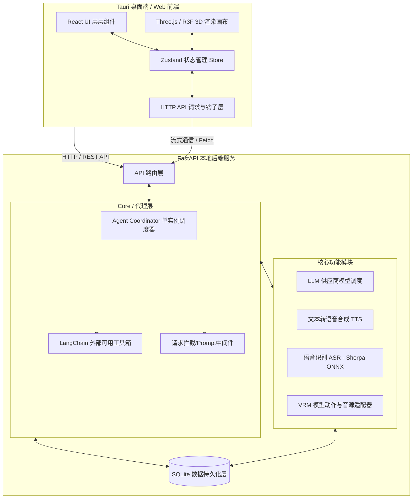
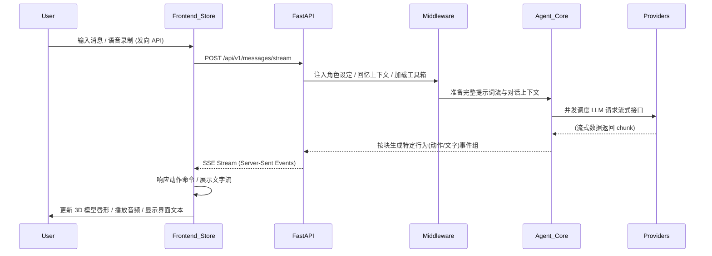

# 系统架构

本文档说明 ATRI Chat 的整体架构、核心模块职责与主要数据流，帮助开发者快速建立系统全局认知。

---

## 1. 整体架构概览

ATRI Chat 是一个跨平台的 AI Agent 桌面/Web 应用程序，采用了典型的前端-后端模式。
借助 **Tauri**，前后端能够作为一个独立的系统进程部署与互相访问，在提供本地桌面程序级别优化的同时，完整保留了 Web 程序的敏捷性开发体系。

### 1.1 系统架构图

---

## 2. 核心组件详解

整个项目在设计上采取了高内聚低耦合的思想。接下来是各个模块的功能边界及具体负责事项：

### 2.1 后端服务 (`FastAPI` & `Python`)

后端是提供数据支撑与 AI 调度的核心，其负责逻辑判断、持久化存储以及各 AI 第三方库的统合调度。

#### 2.1.1 路由层 (`api/routes/`)
路由层只负责校验外部请求，提供正确的端点 (Endpoint)，如：
- **`characters.py`**: 提供角色资料的查询、修改、添加。
- **`messages.py` & `conversations.py`**: 会话控制和消息收发逻辑，将请求下发给 Agent 控制器处理。
- **`asr.py` / `tts.py`**: 音视频信号与转换工具层调用。

#### 2.1.2 代理协调核心 (`core/agent_coordinator.py`)
这是整个系统的灵魂。在这个模块中：
- **基于 Singleton 实例管理**：不为单一模型/角色创建独立的 LangGraph，系统存在全局复用的大模型流水线。
- **动态上下文 (Middlewares) 注入**：每次有用户进行对话交互时，这里会利用拦截器动态拼接当前选择角色的 `System Prompts`、所需的各类记忆以及所选模型的 Token 定义。
- **流式返回机制**：运用 `AsyncGenerator` 控制数据返回，确保 LLM 推理内容与后续的声音、动作数据可以同时/平滑响应至前端。

#### 2.1.3 数据访问层 (Repository & Service)
- **Repositories**：高度抽象的数据库接口。如 `CharacterRepository` 只专门负责对 SQLAlchemy 进行封装。
- **Services**：服务层封装了业务逻辑。如 `ConversationService` 负责验证会话状态的合法性并自动创建或组装关联的历史聊天记录，最后更新到持久化 `sqlite` 中。

#### 2.1.4 AI 功能引擎层 (`tts/` / `asr/` / `vrm/`)
- **TTS 层**：通过工厂模式支持了各种声音供应商，能够根据设定好的发音参数驱动相应的音波数据，并利用正则预处理切分语句来减少响应长文本时的语音生成延迟。
- **ASR 层**：采用 `Sherpa ONNX` 模型（本地离线运行）直接解析用户的音频录入阵列数据以输出中文/字母数据。
- **VRM 资源层**：解析和挂载了虚拟人使用的情感模型，并将 LLM 的语境标签翻译为前端可触发的 3D `.vrma` 动作或情感指令。

---

### 2.2 前端工程 (`React` & `Vite` & `Threejs`)

前端负责用户交互体验与呈现，尤其是将复杂的 3D 渲染与对话体进行了整合。

#### 2.2.1 状态管理核心 (`store/`)
使用 `Zustand` 处理极高频度的更新：
- 拆分了 `chatStore`（存储聊天记录）、`characterStore`（角色信息） 以及 **`useVRMStore`**（管理 3D 渲染配置及实时动作/表情状态）。
- `Zustand` Store 与 `vrm/hooks` 高度配合，实现了配置的自动持久化（LocalStorage）与零开销状态同步。

#### 2.2.2 3D 渲染控制层 (`react-three-fiber` / `@pixiv/three-vrm`)
使用基于 React 语法包装的 `r3f` 控制三维视图：
- **骨骼同步器**：通过后端抛出的表情（如：开心、悲伤）与动作文件信号，这套系统负责动态插值（Lerp）生成中间过渡动画（BlendShape 同步），令角色交互更生动。
- **语音 Lipsync 机制**：由于后端的 TTS 会返回含有时间戳对齐参数的响应格式（例如元音包体），前端在播放音频对象时驱动 VRM 的嘴部形变靶向控制节点。

#### 2.2.3 视图组件与页面 (`pages/` & `components/`)
基于 Tailwind CSS 与无状态功能组件：
- 将模型管理、ASR 设定与界面控制解耦为不同抽屉页或卡片，确保修改单一模块不影响全局其他视图。

---

## 3. 数据与交互流 (Data Flow)

以下展示了当用户发送一条文本或语音到接收到 AI 反应的典型完整交互生命周期：

## 4. 桌面环境打包依赖 (Tauri 集成)

当项目经由 `scripts/release.py` 被打包为桌面 `.exe` 格式时：
- Tauri 框架会将本地网页环境承载在内嵌浏览器框架（Webview2 等）当中运行。
- `pyinstaller` 会以 `onedir` 方式将 Python 后端与 `sherpa-onnx` 等环境整理到 `binaries/` 中，避免单文件自解压带来的额外兼容成本。
- 上述后端进程由前端窗体生命周期守卫控制，两者共生并在桌面端环境下暴露至 `127.0.0.1` 固定网卡下通过轻量 REST 相互通信。
