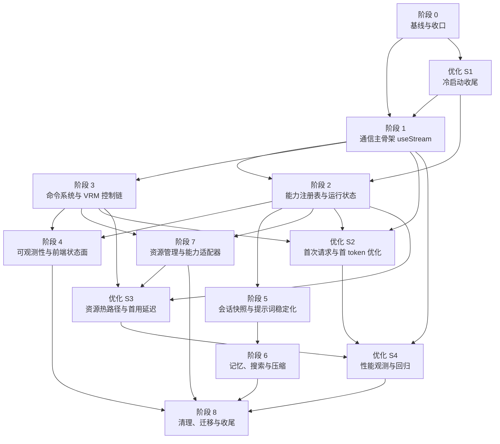

# 整体重构实施计划

本文档是 ATRI Chat 本轮整体重构的正式执行计划。

它不是新的架构蓝图，而是把以下已定稿内容整理为可逐阶段落地的施工顺序：

- [启动优化方案](./启动优化方案.md)
- [系统性能与运行时升级方案](./系统性能与运行时升级方案.md)
- [命令系统设计](./命令系统设计.md)

本计划的目标是：

- 让我们可以按阶段逐一重构
- 明确每个阶段的前置依赖、可并行项和验收标准
- 避免一边改通信层、一边改能力层、一边改 VRM 执行层导致互相打架

---

## 1. 执行前提

以下设计在本计划中视为已定稿，不再反复摇摆：

1. `conversation_id == thread_id`
2. 前端通信直接切到 `useStream` 风格
3. `CapabilityRegistry` 负责能力生命周期管理
4. `capability profile` 面向系统，`toolset` 面向模型
5. ASR/TTS/VRM 属于 `Capability + Adapter`
6. VRM 模式由 AI 输出意图，前端执行控制
7. 命令系统第一版采用 [命令系统设计](./命令系统设计.md) 中定义的最小命令集

### 1.1 文档边界

本轮重构**不以** `docs/03-规划/架构升级方案/` 目录作为正式执行依据。

该目录保留为历史设计记录；本轮实施的正式依据只有：

- [系统性能与运行时升级方案](./系统性能与运行时升级方案.md)
- [命令系统设计](./命令系统设计.md)
- 本文档

---

## 2. 总体策略

总体采用：

> **先搭运行时主骨架，再做垂直链路贯通，最后替换旧实现。**

避免以下错误顺序：

- 先大规模改 VRM 前端，再补通信层
- 先引入一堆新能力目录，再没有统一 registry
- 先把命令系统做复杂，再没有稳定的前后端状态流

我们采用的正确顺序是：

1. 持续推进系统优化专项线，保证启动、首屏、首次请求和资源热路径持续变快
2. 打通 `useStream` 通信主骨架
3. 建立 `CapabilityRegistry` 和运行状态接口
4. 把 `perform_actions` 这一条 VRM 控制链跑通
5. 补可观测性和前端状态面
6. 固化会话快照、提示词稳定化和长期记忆边界
7. 最后推进资源管理、能力适配器和历史代码收敛

---

## 3. 阶段总览

### 3.1 里程碑定义

| 里程碑 | 含义 |
|---|---|
| `M1` | `useStream` 文本对话主链可用 |
| `M2` | `CapabilityRegistry` 和运行状态 API 可用 |
| `M3` | `perform_actions -> StreamAdapter -> VRMDirector` 链路可用 |
| `M4` | 前端能看见 Agent / Tool / Capability 运行状态 |
| `M5` | 会话快照、稳定 prompt、thread 恢复机制可用 |
| `M6` | 长会话搜索与压缩可用 |
| `M7` | ASR/TTS/VRM 适配器和资源管理统一收口 |
| `MX` | 启动、首屏、首次请求、首次资源加载达到目标性能基线 |

---

## 4. 阶段依赖关系

### 4.1 强依赖

| 阶段 | 必须依赖 |
|---|---|
| 阶段 1 | 阶段 0 |
| 阶段 2 | 阶段 1 |
| 阶段 3 | 阶段 1 |
| 阶段 4 | 阶段 2 + 阶段 3 |
| 阶段 5 | 阶段 2 |
| 阶段 6 | 阶段 5 |
| 阶段 7 | 阶段 2 + 阶段 3 |
| 阶段 8 | 阶段 4 + 阶段 6 + 阶段 7 |

### 4.2 可并行关系

- 阶段 2 与阶段 3 可并行推进，但阶段 4 必须等待二者一起完成
- 阶段 5 与阶段 7 可并行推进
- 阶段 6 不能早于阶段 5
- 阶段 8 只负责替换和清理，不应抢在主链稳定前开始

### 4.3 最容易卡住的依赖点

1. `useStream` 主骨架不稳定，会拖住后续一切前端状态流
2. `CapabilityRegistry` 不先抽出来，ASR/TTS/Agent 生命周期会继续分散
3. `perform_actions` 命令链不先收敛，VRM 前端很难稳定
4. `conversation_id == thread_id` 不先落地，后续快照和恢复都会反复返工

### 4.4 系统优化专项线

系统优化不是“已经完成的背景项”，而是本轮重构中的一条独立专项线。  
它来源于 [启动优化方案](./启动优化方案.md)，且目前只解决了一部分，还没有完全解决。

#### 4.4.1 已完成的部分

- Tauri 已改为不在启动时同步等待后端健康检查
- 前端已有 `BootstrapGate`，可以先渲染再等待后端就绪
- 后端已做过一轮导入瘦身和重依赖下沉
- ASR 与模型工厂已做过一轮懒导入
- Agent 已改为惰性实例化，并在启动后延迟预热

#### 4.4.2 仍未完全解决的问题

- `main.py` 仍在模块导入阶段注册全部路由，冷启动路径仍偏重
- 启动耗时埋点和结构化回归基线还没有建立
- 首次聊天、首次 VRM、首次 ASR/TTS 的首用延迟还未系统治理
- 资源热路径、缓存命中率和回收策略还未统一收口
- `CapabilityRegistry` 尚未落地，能力按需加载仍然分散

#### 4.4.3 优化阶段划分

| 优化阶段 | 目标 | 当前状态 | 依赖 | 可并行 |
|---|---|---|---|---|
| `S1` 冷启动收尾 | 继续压缩 `import main`、`/health ready`、首屏阻塞路径 | 已部分完成 | 阶段 0 | 可与阶段 1、阶段 2 并行 |
| `S2` 首次请求与首 token 优化 | 优化首次聊天、首次 tool call、首次 VRM 输出延迟 | 未完成 | 阶段 1 + 阶段 2 + 阶段 3 | 可与阶段 4 并行 |
| `S3` 资源热路径与首用延迟 | 优化首次 ASR/TTS/VRM/动作加载、缓存命中与资源回收 | 未完成 | 阶段 2 + 阶段 3 + 阶段 7 | 可与阶段 6 并行 |
| `S4` 性能观测与回归 | 建立结构化耗时埋点、性能回归门禁与观测面板 | 未完成 | 阶段 1 起即可开始，阶段 2/3/7 后完善 | 贯穿全程 |

#### 4.4.4 系统优化线的验收指标

- 窗口可见时间
- 前端首屏可交互时间
- `/api/v1/health` ready 时间
- 首次聊天首 token 时间
- 首次 VRM 模式进入时间
- 首次 ASR 初始化时间
- 首次 TTS 初始化时间
- 首次 `perform_actions` 到前端执行完成时间
- 资源缓存命中率
- 性能回归波动范围

---

## 5. 阶段 0：基线与收口

**目标：** 在正式大改前，把关键决策、基线指标和旧实现边界收口，避免边做边改口径。

### 5.1 产出

- 当前性能与启动基线
- 当前消息流、VRM 模式、ASR/TTS 调用路径清单
- 旧实现与新实现的边界清单
- 本轮重构的“禁止事项”列表

### 5.2 核心任务

1. 固化重构决策
   - `conversation_id == thread_id`
   - `useStream` 直切
   - `CapabilityRegistry`
   - `perform_actions`
2. 记录当前基线
   - 启动时间
   - 首 token 时间
   - VRM 模式进入时间
   - ASR/TTS 首次初始化时间
3. 梳理旧路径
   - 旧 SSE 路径
   - 旧 VRM 控制路径
   - 旧 ASR/TTS 直连路径

### 5.3 依赖

- 无前置依赖

### 5.4 验收标准

- 所有关键架构决策已在文档中收口
- 有可复测的当前性能基线
- 团队知道哪些旧文档不再作为实施依据

---

## 6. 阶段 1：通信主骨架 `useStream`

**目标：** 先让系统围绕官方 streaming v2 事件模型跑起来，替换现有自定义 SSE 解析主链。

### 6.1 产出

- useStream 兼容后端端点
- 前端 `useAgentStream` 或同等能力的流式消费 hook
- 文本模式下完整消息流可用
- tool call 和 custom event 主通路建立

### 6.2 核心任务

#### 后端

1. 新建 useStream 兼容端点
   - 输出 `messages / updates / custom / interrupts / metadata`
2. 精简旧的消息累积和 SSE 特制 payload 逻辑
3. 统一 `conversation_id` 作为 `thread_id`

#### 前端

1. 引入 `@langchain/langgraph-sdk`
2. 新建 `useAgentStream`
3. 建立：
   - 聊天时间线
   - tool call 卡片
   - custom event 分发入口
4. 保证文本模式先跑通

### 6.3 依赖

- 依赖阶段 0

### 6.4 可并行项

- 后端 useStream 端点
- 前端 `useAgentStream` 和聊天时间线 UI

### 6.5 验收标准

- 用户发消息后能稳定流式收到文本
- tool call 可显示开始、进行中、结束
- custom events 能到达前端
- 旧 SSE 主链不再是新功能的基础

---

## 7. 阶段 2：`CapabilityRegistry` 与运行状态接口

**目标：** 把 Agent / ASR / TTS / VRM 的生命周期抽到统一管理层。

### 7.1 产出

- `CapabilityRegistry` 第一版
- 统一能力状态模型
- `/runtime/status` 接口
- 能力状态事件流

### 7.2 核心任务

1. 定义能力状态
   - `disabled`
   - `uninitialized`
   - `warming`
   - `ready`
   - `busy`
   - `failed`
2. 抽出 registry
   - `agent`
   - `asr`
   - `tts`
   - `vrm`
3. 建立运行状态服务
4. 前端接入最小状态查询

### 7.3 依赖

- 强依赖阶段 1

### 7.4 可并行项

- registry 核心结构
- runtime status API
- 前端状态查询 hook

### 7.5 验收标准

- 四个核心能力都可查询状态
- 控制面不再直接持有重能力实例
- 前端能看到能力是否 ready / warming / failed

---

## 8. 阶段 3：命令系统与 VRM 控制链

**目标：** 跑通 `perform_actions -> 前端执行` 这条最核心的 VRM 纵向链路。

### 8.1 产出

- `perform_actions` 工具
- 命令解析器与校验器
- `StreamAdapter`
- `VRMDirector` 最小执行链
- `control_camera` 独立工具

### 8.2 核心任务

#### 后端

1. 注册 `perform_actions`
2. 注册 `control_camera`
3. 将 AI 输出与命令工具分离
4. 为 `say` 命令引出 TTS 后处理入口

#### 前端

1. 建立命令解析器
   - 输入：`commands: string[]`
   - 语法：
     - `say <emotion> | <text>`
     - `emotion <name>`
     - `motion <name>`
     - `wait <ms>`
2. 建立命令校验器
3. 建立 `StreamAdapter`
4. 建立最小 `VRMDirector`
5. 先支持：
   - 文本显示
   - 表情切换
   - 动作意图挂载
   - 叙事停顿

### 8.3 依赖

- 强依赖阶段 1

### 8.4 可并行项

- 后端工具注册
- 前端命令解析器 / 校验器
- 前端 Director 最小骨架

### 8.5 验收标准

- AI 调用 `perform_actions` 后，前端能正确执行最小命令集
- `motion` 作为动作意图参与下一句 `say`
- `control_camera` 与 `perform_actions` 完全分离
- AI 不再直接控制状态机

---

## 9. 阶段 4：可观测性与前端状态面

**目标：** 让前端能看见 Agent、Tool、Capability、VRM 执行的实时状态。

### 9.1 产出

- `AgentRunEvent` / `CapabilityEvent` 统一事件模型
- 运行状态面板
- tool call / custom event / step 状态汇总
- 调试抽屉或最小诊断视图

### 9.2 核心任务

1. 收敛流事件
   - `messages`
   - `updates`
   - `custom`
   - `interrupts`
2. 后端持久化关键事件
3. 前端状态面板显示：
   - 当前 toolset
   - 当前 run_id
   - 当前 capability 状态
   - 最近错误
4. 把 VRM 驱动状态纳入事件流

### 9.3 依赖

- 强依赖阶段 2
- 强依赖阶段 3

### 9.4 可并行项

- 后端事件归一化与持久化
- 前端运行状态面板
- 调试抽屉

### 9.5 验收标准

- 用户和开发者都能看见系统正在做什么
- 能区分 Agent 卡住、工具失败、能力未就绪、VRM 执行中
- 前端不再依赖字符串日志猜状态

---

## 10. 阶段 5：会话快照与提示词稳定化

**目标：** 把提示词和会话运行上下文固化下来，减少后续继续漂移。

### 10.1 产出

- `conversation_sessions`
- `system_prompt_snapshot`
- `toolset_snapshot`
- `capability_profile_snapshot`
- 稳定的会话恢复入口

### 10.2 核心任务

1. 会话创建时生成快照
2. 将每轮动态 recall 改成临时注入
3. 把会话运行上下文与快照解耦
4. 固化恢复和重放入口

### 10.3 依赖

- 强依赖阶段 2

### 10.4 可并行项

- 后端会话快照模型
- prompt policy 服务
- 前端会话恢复入口

### 10.5 验收标准

- 同一会话中 system prompt 不再漂移
- 会话可回放、可诊断
- capability profile / toolset 可追溯

---

## 11. 阶段 6：记忆、搜索与压缩

**目标：** 在稳定快照基础上，补足长会话能力，而不是提前把上下文层做复杂。

### 11.1 产出

- 会话搜索
- 消息 FTS
- 摘要压缩
- 长期记忆与会话记忆边界收口

### 11.2 核心任务

1. 为消息建立 FTS
2. 会话摘要表与压缩策略
3. 区分：
   - checkpointer
   - store
   - 业务表
4. 做好记忆召回与 UI 搜索入口

### 11.3 依赖

- 强依赖阶段 5

### 11.4 可并行项

- 搜索服务
- 摘要服务
- UI 搜索页 / 搜索抽屉

### 11.5 验收标准

- 长会话可以压缩后继续对话
- 历史会话可搜索
- 长期记忆不会继续挤占消息表职责

---

## 12. 阶段 7：资源管理与能力适配器

**目标：** 统一收口 ASR/TTS/VRM 的能力内核、适配器和资源生命周期。

### 12.1 产出

- manifest / materialization 服务
- ASR/TTS/VRM adapter 统一目录
- UI API 与 Agent Tool 边界正式落地
- 缓存与回收策略

### 12.2 核心任务

1. 资源清单与实体化
2. 统一：
   - `ui_api`
   - `agent_tool`
   - `background_job`
3. 建立缓存与回收策略
4. 收敛旧的直连初始化逻辑

### 12.3 依赖

- 强依赖阶段 2
- 强依赖阶段 3

### 12.4 可并行项

- ASR adapter 收口
- TTS adapter 收口
- VRM adapter 收口
- 资源缓存服务

### 12.5 验收标准

- ASR/TTS/VRM 本体只有一份运行时
- UI 和 Agent 共用同一套能力本体
- 首次使用和重复使用的资源行为可预测

---

## 13. 阶段 8：清理、迁移与收尾

**目标：** 在新链路稳定后，移除旧路径并做最终一致性收口。

### 13.1 产出

- 旧 SSE / 旧 VRM 控制路径清理
- 文档和目录一致性收口
- 指标回归结果
- 留给下一轮能力扩展的干净骨架

### 13.2 核心任务

1. 清理旧路径
2. 收口历史兼容代码
3. 补回归测试与手动验收清单
4. 更新开发文档和架构文档

### 13.3 依赖

- 强依赖阶段 4
- 强依赖阶段 6
- 强依赖阶段 7

### 13.4 验收标准

- 新链路成为唯一主链
- 旧路径不再影响后续开发
- 文档、代码结构、运行时行为一致

---

## 14. 推荐实施顺序

### 14.1 串行主线

1. 阶段 0
2. 优化 `S1`：冷启动收尾
3. 阶段 1
4. 阶段 2
5. 阶段 3
6. 优化 `S2`：首次请求与首 token 优化
7. 阶段 4
8. 阶段 5
9. 阶段 6
10. 阶段 7
11. 优化 `S3`：资源热路径与首用延迟
12. 优化 `S4`：性能观测与回归
13. 阶段 8

### 14.2 允许的并行方式

如果多人并行，推荐这样拆：

- 线路 A：优化 `S1` -> 阶段 1 -> 阶段 3 -> 优化 `S2` -> 阶段 4
- 线路 B：阶段 2 -> 阶段 5 -> 阶段 6
- 线路 C：阶段 2 -> 阶段 7 -> 优化 `S3`
- 线路 D：优化 `S4` 从阶段 1 开始贯穿全程

最终在阶段 8 汇合。

---

## 15. 每阶段结束后必须回答的问题

每完成一个阶段，都要回答以下问题再进入下一阶段：

1. 这一阶段新增的主链路是否已经可运行？
2. 这一阶段是否引入了新的双轨实现？如果有，是否明确了退役计划？
3. 前端是否已经能观察到这阶段新增的状态？
4. 这一阶段的新增结构，是否服务下一阶段，而不是变成新的历史包袱？

---

## 16. 当前建议的开工点

如果现在开始实施，我建议从以下顺序开工：

1. 优化 `S1`：继续收尾启动路径与冷启动埋点
2. 阶段 1：`useStream` 通信主骨架
3. 阶段 2：`CapabilityRegistry` 第一版
4. 阶段 3：`perform_actions` + `control_camera` + `StreamAdapter`

原因：

- 冷启动和首屏优化还没有完全做完，不应在后续阶段反复返工
- 这是最核心的主链
- 能最快验证架构是否站得住
- 能尽早把旧 SSE 和旧 VRM 控制路径边缘化
- 后续可观测性、会话快照、资源管理都会建立在这四步之上
